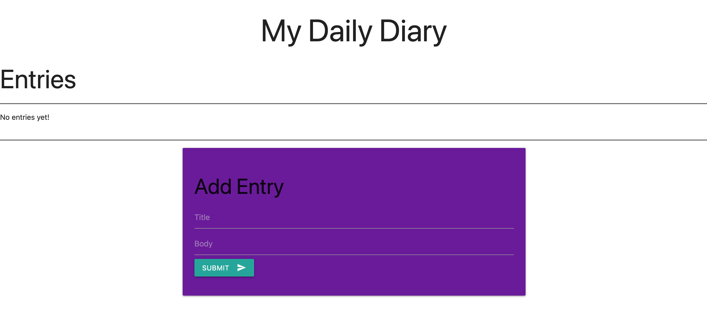
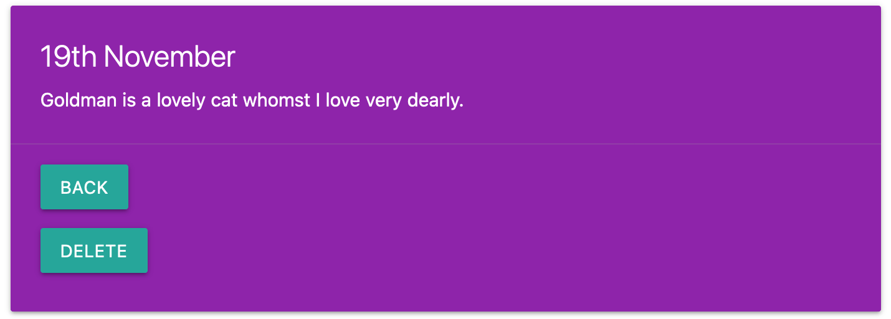

## Daily Diary 📔
A Ruby 💎 (with Sinatra) simple web app using the Materialize CSS framework for a single user to save and view diary entries that are saved in to PostgreSQL. This was my first project combining an MVC powered web app with a database. I built the app using the principles of TDD, and the code has a 100% coverage in simplecov.

## Usage

 1. Install PostgreSQL, follow the instructions in './db/create_diary_table.sql'.
 2. Clone the repo
 3. Launch the server with the 'rackup' command executed in the root project folder.
 4. Visit 'localhost:9292', or replace with whichever port rackup outputs to the terminal.

## Screenshots

